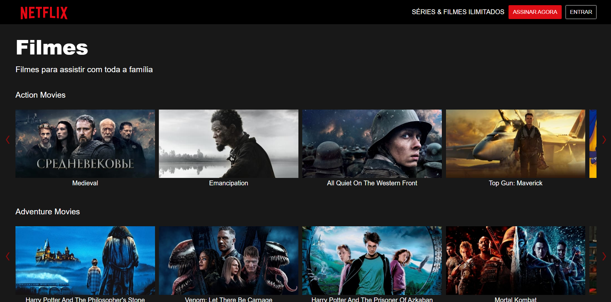

<h1 align="center"> Netflix </h1>

Projeto desenvolvido durante o webinário oferecido pela Dio.me

  <a href="#-tecnologias">Tecnologias</a>&nbsp;&nbsp;&nbsp;|&nbsp;&nbsp;&nbsp;
  <a href="#-projeto">Projeto</a>&nbsp;&nbsp;&nbsp;|&nbsp;&nbsp;&nbsp;
  <a href="#memo-licença">Licença</a>

  

 

  

## 🚀 Tecnologias

Esse projeto foi desenvolvido com as seguintes tecnologias:

- JavaScript
- NodeJS
- HTML e CSS

## 💻 Projeto

Esse projeto apresenta um clone da Netflix.

## :memo: Licença

Esse projeto está sob a licença MIT.

---
